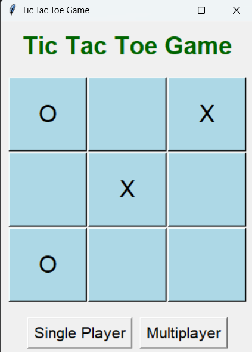

# Tic Tac Toe Game
A fun, interactive Tic Tac Toe game built using Python's tkinter library. The game supports single-player mode (with AI using the Minimax algorithm) and multiplayer mode. Enjoy classic gameplay on a clean, user-friendly interface.

## Features

### Two Game Modes:
* Single-player mode with AI opponent.
* Multiplayer mode to play with friends.
### AI Powered by Minimax Algorithm:
* The AI opponent makes strategic moves to challenge the player.
### Responsive 3x3 grid interface built with tkinter.
* Displays the winner or a tie message at the end of each game.
* Reset and replay functionality.

## Demo

